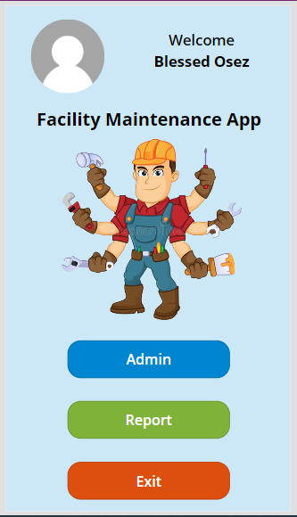

# Facility Maintenance (PowerApps Project)
## Introduction

This repo contains a solution for a Facility Maintenance app for any organisation, the organisation in focus is a Tetiary Institution. Logging of complaints with regards to public hostel facilities is done at the porters lodge on a log book, the details of the complain are written on the book and then it is sent once in 3 days to the respective Maintenance office, they review the complaint and come to access the issue before they choose a day to come again for repairs.
The whole process is manual and tedious. The documentation process isn't detailed enough and its time consuming between when the complaint is laid to when they come for the final repair.

## Solution Overview
This proposed solution is an automatic process, that allows complaints to be logged and sent directly to the maintenance office. And a picture of the issue is sent along with the complaint this gives maintenance an idea of the problem and what is needed from them. Using this approach cuts back the logging complaint to repair time by 70%. 
A very detailed record is kept on the Dataverse tables with regards to 

- who made the complain,
- what was the detail of the complain,
- who received the complaint,
- who addressed the issue,
- how much was spent on the repair,
- who inspected the work post repair,
- the image of the work before and after repair etc.

## Design Overview

